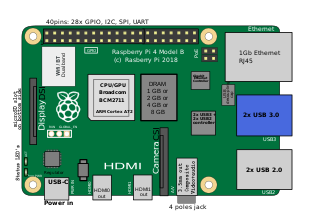

# WuPiWeather

Weather station using Raspberry Pi with BME280 environmental sensor which can measure temperature, pressure and humidity. Sensor data can be uploaded to Weather Underground for display.

# Hardware Configuration

This guide assumes you have already setup your Raspberry Pi by installing Raspberry Pi OS. Configuration of WuPiWeather in this guide is shown in terminal but could also be accomplished in Desktop GUI.



Connect BME280 sensor to Raspberry Pi GPIO using table below as reference. The [pinout.xyz](https://pinout.xyz/# "https://pinout.xyz/#") website is a good reference to use when connecting devices to the Raspberry Pi. Place sensor away from any heat sources to improve temperature measurement accuracy .  The I2C serial bus wire harness length could be extended up to 1 meter. For more technical details about the BME280 sensor please see the datasheet here [BME280 Sensor Datasheet](https://www.bosch-sensortec.com/media/boschsensortec/downloads/product_flyer/bst-bme280-fl000.pdf "https://www.bosch-sensortec.com/media/boschsensortec/downloads/product_flyer/bst-bme280-fl000.pdf").

| BME280 | RPi    | GPIO Pin | Description          |
| :----: | :----: | :----:   | :----:               |
| VDD    | 3v3    | 1        | Power Supply         |
| SDO    | SDA    | 3        | I2C Serial Bus Data  |
| SCK    | SCL    | 5        | I2C Serial Bus Clock |
| GND    | Ground | 9        | Ground               |

Install packages required for I2C functionality.

```
$ sudo apt install i2c-tools
``` 

Enable I2C bus on Raspberry Pi. Output from second command verifies that I2C is enabled if '0' is returned as shown below.

```
$ sudo raspi-config nonint do_i2c 0
$ sudo raspi-config nonint get_i2c
0
```

Alternative: Enable the I2C bus on Raspberry Pi using Configuration Tool. After menu is displayed select [3] Interface Options then select [I5] I2C.

```
$ sudo raspi-config
```

Scan I2C bus to detect connected devices. Example below shows an I2C device on bus 1 at address x76. Note that the address is defined using a hexadecimal number.  This address will be needed later when configuring the weather station software.

```
$ sudo i2cdetect -y 1
     0  1  2  3  4  5  6  7  8  9  a  b  c  d  e  f
00:                         -- -- -- -- -- -- -- -- 
10: -- -- -- -- -- -- -- -- -- -- -- -- -- -- -- -- 
20: -- -- -- -- -- -- -- -- -- -- -- -- -- -- -- -- 
30: -- -- -- -- -- -- -- -- -- -- -- -- -- -- -- -- 
40: -- -- -- -- -- -- -- -- -- -- -- -- -- -- -- -- 
50: -- -- -- -- -- -- -- -- -- -- -- -- -- -- -- -- 
60: -- -- -- -- -- -- -- -- -- -- -- -- -- -- -- -- 
70: -- -- -- -- -- -- 76 --
```

# Software Configuration

Note that you can install this either system wide or in a python virtual environment. This guide will show how to install and configure WuPiWeather system wide but for testing it is recommended to use a python virtual environment. 

```
$ git clone https://github.com/efranzwa/WuPiWeather
$ cd WuPiWeather
$ pip install -r requirements.txt
```

# Example - Sensor Readings

Use the `verify-sensor.py` script to verify that the everything is working correctly prior to deploying the full weather station. The output should display the sensor readings, I2C bus configuration and time of reading in GMT which is needed for weather data upload.

```
$ python verify-sensor.py
I2C bus     =  1
BME280 Addr =  0x76
Timestamp   =  2022-12-03 15:09:38.755636+00:00 GMT
Temperature =  17.43 C
Pressure    =  1002.62 hPa
Humidity    =  34.39 %RH
```

# Example - Weather Station

Add code block showing how to start, how to auto-start on boot.

# Weather Data

After data has been uploading to Weather Underground you will be able to view the PWS web page.

