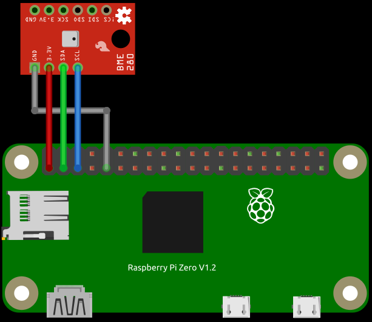
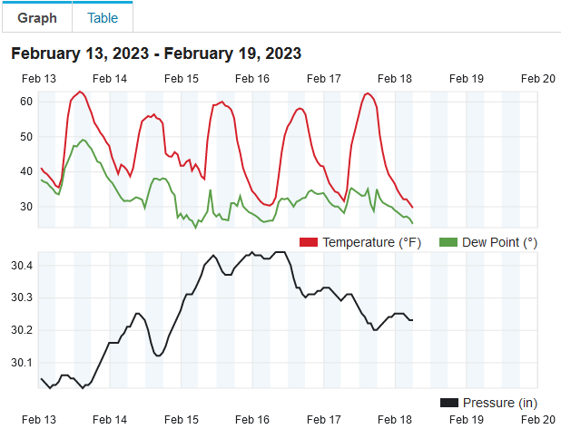
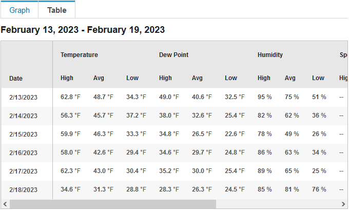

# WuPiWeather

Weather station using Raspberry Pi with BME280 environmental sensor which can measure temperature, pressure and humidity. Sensor data can be uploaded to Weather Underground for display.

# Hardware Configuration

This guide assumes you have already setup your Raspberry Pi by installing Raspberry Pi OS. Configuration of WuPiWeather in this guide is shown in terminal but could also be accomplished in Desktop GUI.



Connect BME280 sensor to Raspberry Pi GPIO using table below as reference. The [pinout.xyz](https://pinout.xyz/# "https://pinout.xyz/#") website is a good reference to use when connecting devices to the Raspberry Pi. Place sensor away from any heat sources to improve temperature measurement accuracy. The I2C serial bus wire harness length could be extended up to 1 meter. For more technical details about the BME280 sensor please see the datasheet here [BME280 Sensor Datasheet](https://www.bosch-sensortec.com/media/boschsensortec/downloads/product_flyer/bst-bme280-fl000.pdf "https://www.bosch-sensortec.com/media/boschsensortec/downloads/product_flyer/bst-bme280-fl000.pdf").

| BME280 | RPi    | GPIO Pin | Description          |
| :----: | :----: | :----:   | :----:               |
| VDD    | 3v3    | 1        | Power Supply         |
| SDO    | SDA    | 3        | I2C Serial Bus Data  |
| SCK    | SCL    | 5        | I2C Serial Bus Clock |
| GND    | Ground | 9        | Ground               |

Install packages required for I2C functionality.

```console
$ sudo apt install i2c-tools
``` 

Enable I2C bus on Raspberry Pi. Output from second command verifies that I2C is enabled if '0' is returned as shown below.

```console
$ sudo raspi-config nonint do_i2c 0
$ sudo raspi-config nonint get_i2c
0
```

Alternative: Enable the I2C bus on Raspberry Pi using Configuration Tool. After menu is displayed select [3] Interface Options then select [I5] I2C.

```console
$ sudo raspi-config
```

Scan I2C bus to detect connected devices. Example below shows an I2C device on port 1 at address x76. Note that the address is defined using a hexadecimal number. The PORT and ADDRESS will be needed later when configuring the weather station software.

```console
$ sudo i2cdetect -y 1
     0  1  2  3  4  5  6  7  8  9  a  b  c  d  e  f
00:                         -- -- -- -- -- -- -- -- 
10: -- -- -- -- -- -- -- -- -- -- -- -- -- -- -- -- 
20: -- -- -- -- -- -- -- -- -- -- -- -- -- -- -- -- 
30: -- -- -- -- -- -- -- -- -- -- -- -- -- -- -- -- 
40: -- -- -- -- -- -- -- -- -- -- -- -- -- -- -- -- 
50: -- -- -- -- -- -- -- -- -- -- -- -- -- -- -- -- 
60: -- -- -- -- -- -- -- -- -- -- -- -- -- -- -- -- 
70: -- -- -- -- -- -- 76 --
```

# Software Configuration

Note that you can install this either system wide or in a python virtual environment. This guide will show how to install and configure WuPiWeather system wide but for testing it is recommended to use a python virtual environment. The code in this project assumes the repository is cloned into the pi user home directory.

```console
$ cd ~
$ git clone https://github.com/efranzwa/WuPiWeather
$ cd WuPiWeather
$ pip install -r requirements.txt
```

# Verify Sensor

Use the `verify-sensor.py` script to verify that the everything is working correctly prior to deploying the full weather station. The output should display the sensor readings, I2C bus configuration and time of reading in GMT which is needed for weather data upload.

```console
$ python verify-sensor.py
I2C bus     =  1
BME280 Addr =  0x76
Timestamp   =  2022-12-03 15:09:38.755636+00:00 GMT
Temperature =  17.43 C
Pressure    =  1002.62 hPa
Humidity    =  34.39 %RH
```

# Weather Station Configuration

#### Register Weather Station
Register the weather station in order to enable data upload to Weather Underground. A planned feature of WuPiWeather is to add local data storage and visualization of data but this has not been implemented yet. Use the following link to register your personal weather station (PWS): [https://www.wunderground.com/pws/overview](https://www.wunderground.com/pws/overview "https://www.wunderground.com/pws/overview").

#### Station Configuration File
Edit `wpw-station.conf` with your favorite editor. Use the PORT and ADDRESS from station verification. INTERVAL is recommended at 300 seconds. STATION ID and STATION_KEY will come from your registration with Weather Underground. ALTITUDE will correct for local atmospheric pressure relative to sea level, enter this in feet. 

```console
wpw              # identifies file as configuration - do not change
1                # PORT - I2C port number for sensor
0x76             # ADDRESS - I2C address for sensor
300              # INTERVAL - time between sensor readings in seconds
my-station-id    # STATION_ID - your ID for personal weather station
my-station-key   # STATION_KEY - your key/password for station
https://...      # WU_URL - url for data upload
100              # ALTITUDE - altitude for pressure correction in feet
```

#### Station Configuration
Configuration of the weather station can be accomplished in two ways. The first and preferred method is to copy configuration file `wpw-station.conf` to the `/boot` directory. This allows the wpw software to be upgraded without losing the station configuration.

```console
$ sudo cp ~/WuPiWeather/wpw/wpw-station.conf /boot
```
The second method is to edit `wpw.py` with your specific station parameters. This is not preferred but may be necessary if installing on a device that is not a Raspberry Pi.

# Weather Station Service

It is recommended to implement WuPiWeather as a `systemd` service. This has several benefits. The overall operation of the weather station will be robust as the system service can be configured to start automatically at boot as well as restarting when various issues arise. These issues can include: WiFi connectivity problems, loss of power to the Pi, router/network issues, internet connectivity issues, etc. Keeping the weather station running continuously without user intervention over long periods of time can be a challenge. Another benefit is that logging is available using `systemd journal`.

```console
$ sudo cp ~/WuPiWeather/wpw/wupiweather.service /etc/systemd/system
$ sudo chown root:root /etc/systemd/system/wupiweather.service

# note service file assumes code is here: /home/pi/WuPiWeather/wpw/wpw.py
# edit service file if wpw.py is located in different location

$ sudo systemctl daemon-reload
$ sudo systemctl enable wupiweather.service
$ sudo systemctl start wupiweather.service
```

At this point the WuPiWeather should be running. For debugging the `systemd journal` should be used. Normal startup is indicated by first three entries in the journal. Errors/warnings found while `wpw.py` is running are also logged and can be very helpful when setting up and running the weather station.

```console
$ journalctl -u wupiweather.service
- Journal begins at Sun 2022-08-07 17:04:02 PDT, ends at Sat 2023-02-11 11:42:15 PST. --
Feb 10 06:42:27 nashi systemd[1]: Started WuPiWeather weather station.
Feb 10 06:42:30 nashi python[498]: Found station file wpw-station.conf
Feb 10 06:42:30 nashi python[498]: Using station file wpw-station.conf
Feb 11 11:22:24 nashi python[498]: URL error:   <urlopen error [Errno -3] Temporary failure in name resolution>
Feb 11 11:28:24 nashi python[498]: URL error:   <urlopen error [Errno -3] Temporary failure in name resolution>
```

# Weather Data

After data has been uploading to Weather Underground you will be able to view the personal weather station (PWS) web page. Address for the PWS should be as follows using **your registered station ID**: https://www.wunderground.com/dashboard/pws/my-station-id.




